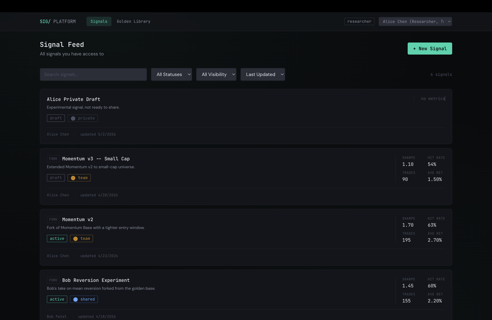
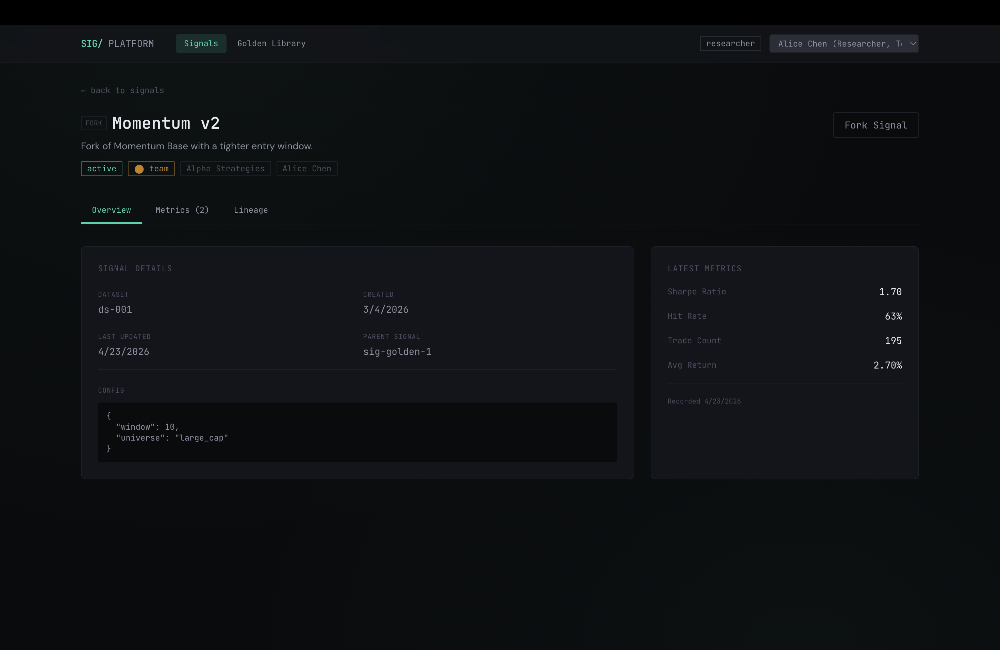
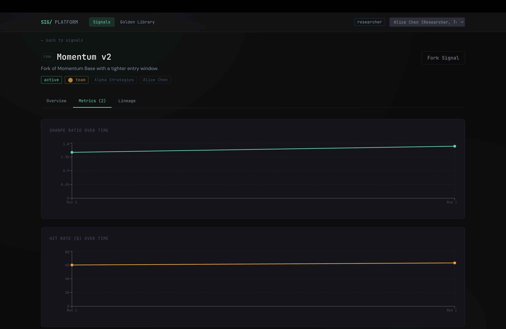
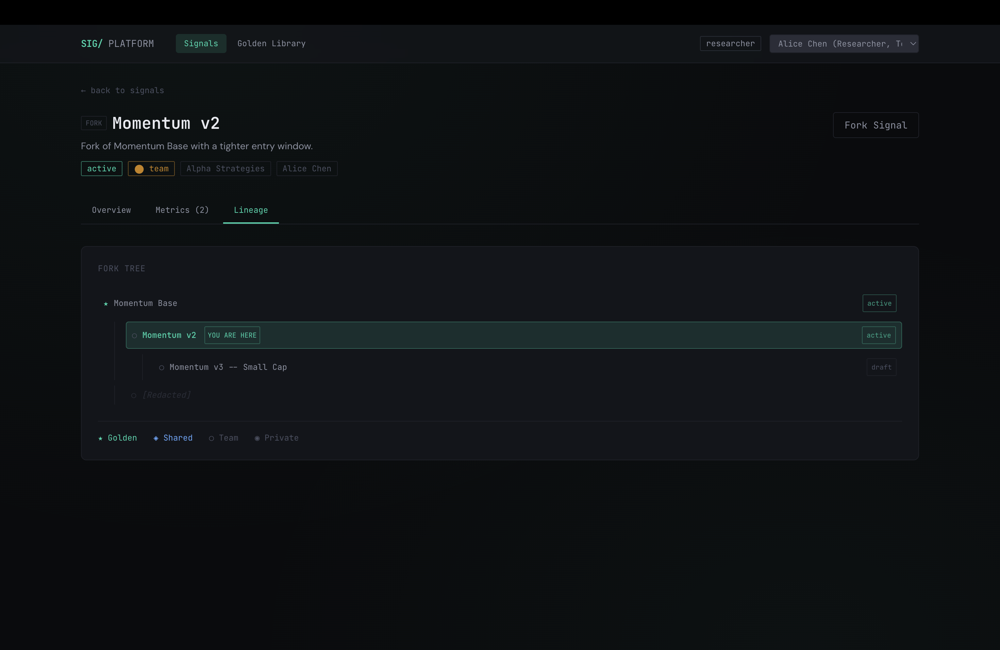
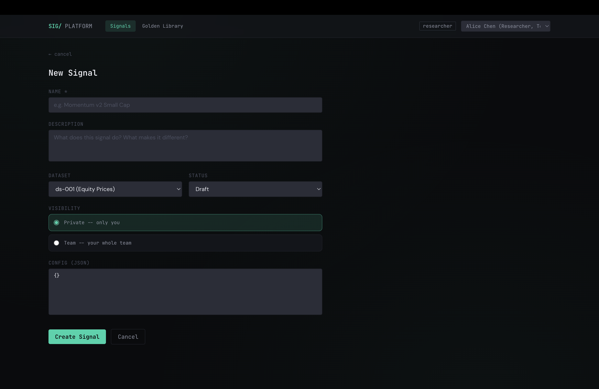
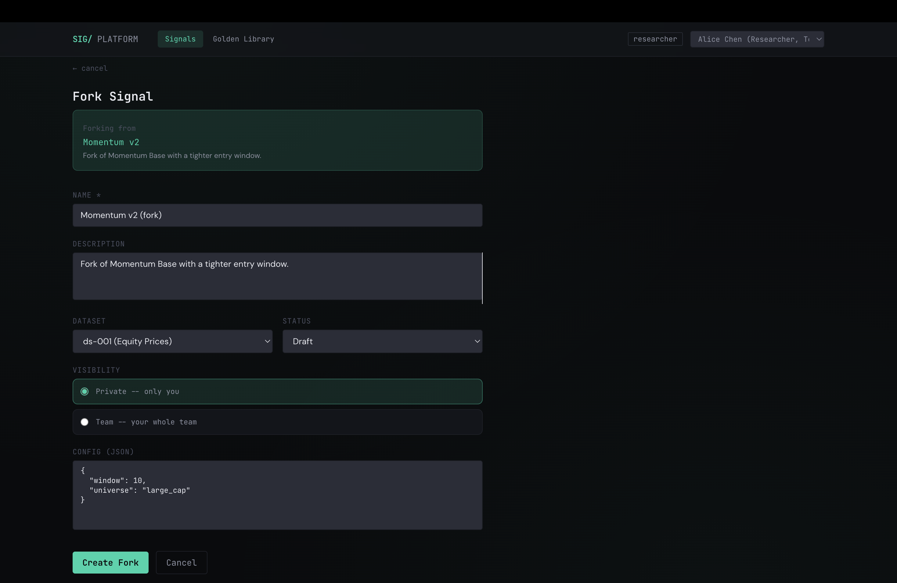
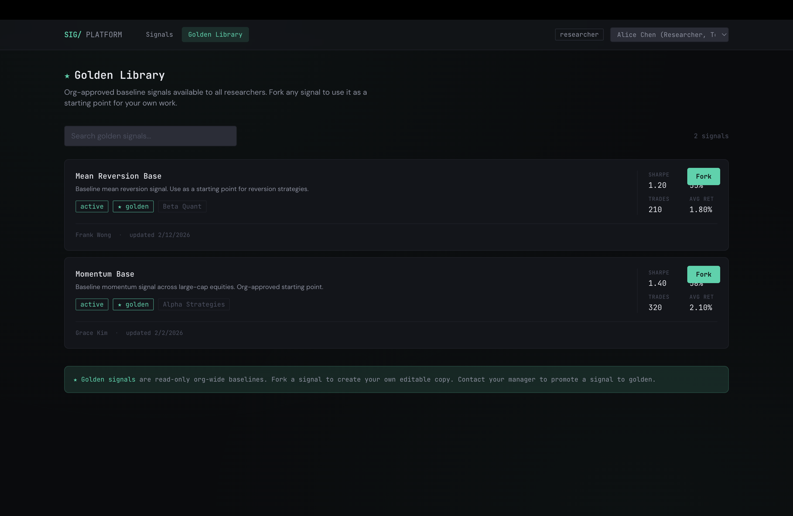
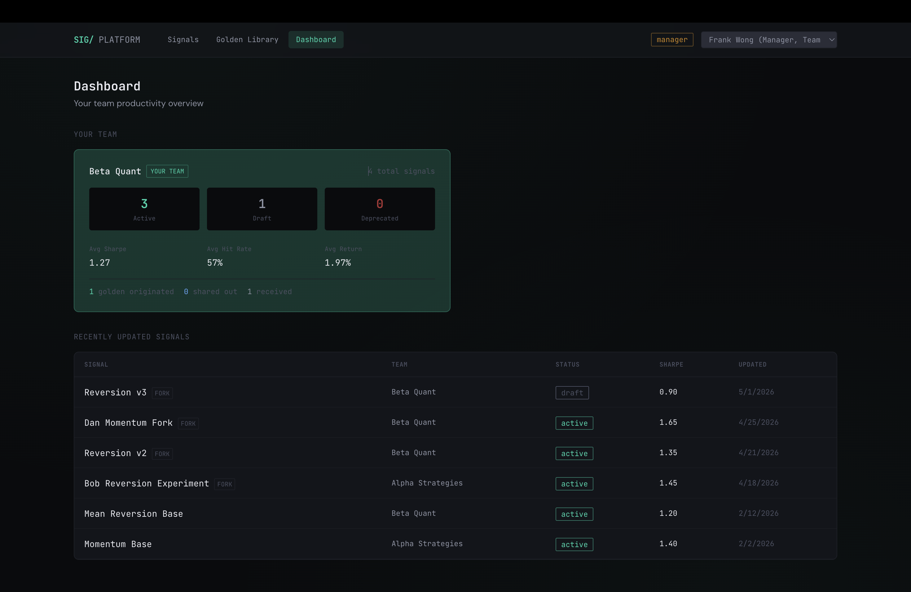
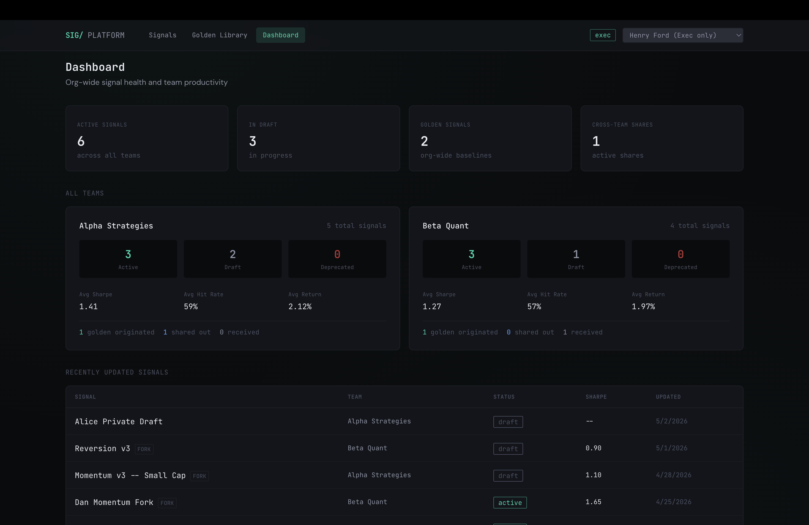
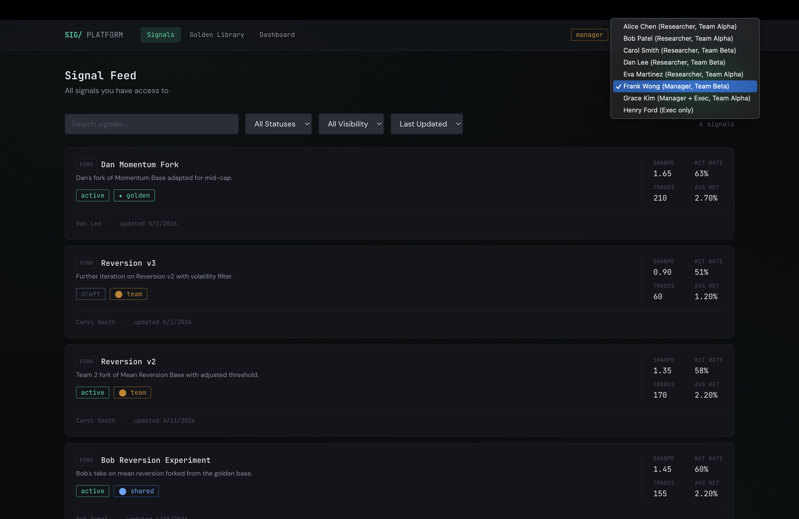

# Signal Research Platform: Case Study


## Table of Contents
1. [Application Overview](#1-application-overview)
2. [Users & Roles](#2-users--roles)
3. [Data Model](#3-data-model)
4. [Assumptions](#4-assumptions)
5. [Questions for Users of the System](#5-questions-for-users-of-the-system)
6. [UI Mockups](#6-ui-mockups)
7. [API Specification](#7-api-specification)
8. [User Flows](#8-user-flows)
9. [Future Work](#9-future-work)

---

## 1. Application Overview

This application is a signal research platform that helps quantitative researchers create, iterate on, and manage **signals** used for trading. A signal is produced by applying some operation to a dataset; the specifics of signal generation and configuration are abstracted away. What matters to this platform is how signals are organized, tracked, shared, and monitored across the organization.

The platform serves three types of users: researchers, managers, and executives, each with different levels of access and different goals. Researchers need a workspace to build and experiment with signals. Managers need visibility into their team's output and the ability to control what gets shared. Executives need an org-wide picture of signal health and team productivity.

Data security is a first-class concern. Researchers and teams do not always share data with each other, and it is critical that users only ever see data they have explicit permission to access.

---

## 2. Users & Roles

There are three named user types in the problem, which map to four distinct permission levels in practice:

```
Exec (org-wide visibility)
  └── Manager-Exec (is both a manager AND exec)
        └── Manager (sees their team + any shared signals + golden signals)
              └── Researcher (sees their team + any shared signals + golden signals)
```

| Role           | Description                                                                      |
|----------------|----------------------------------------------------------------------------------|
| `researcher`   | Team-scoped. Sees own signals, team signals, signals shared to their team, and golden signals. |
| `manager`      | Same as researcher, plus can grant cross-team sharing for signals their team owns. |
| `exec`         | Org-wide read access to all signals and teams.                                   |
| `manager_exec` | Org-wide read access plus the ability to manage cross-team sharing.              |

**Notes:**
- Researchers work in teams of 4–7. Every team has exactly one manager.
- Some executives are also managers and have a team assignment. Some are exec-only with no team.
- Managers and executives have access to productivity dashboards and signal health monitoring.

---

## 3. Data Model

### User
| Field     | Type                                                    | Notes             |
|-----------|---------------------------------------------------------|-------------------|
| `id`      | UUID                                                    | Primary key       |
| `name`    | string                                                  |                   |
| `email`   | string                                                  |                   |
| `role`    | enum: `researcher` `manager` `exec` `manager_exec`      |                   |
| `team_id` | UUID → Team                                             | Null if exec-only |

### Team
| Field        | Type        | Notes                     |
|--------------|-------------|---------------------------|
| `id`         | UUID        | Primary key               |
| `name`       | string      |                           |
| `manager_id` | UUID → User | The team's single manager |

Team members are looked up by querying `User` where `team_id` matches.

### Signal
| Field              | Type                                         | Notes                                |
|--------------------|----------------------------------------------|--------------------------------------|
| `id`               | UUID                                         | Primary key                          |
| `name`             | string                                       |                                      |
| `description`      | string                                       |                                      |
| `status`           | enum: `draft` `active` `deprecated`          | Researcher-controlled                |
| `visibility`       | enum: `private` `team` `shared` `golden`     | See rules below                      |
| `created_by`       | UUID → User                                  |                                      |
| `team_id`          | UUID → Team                                  | Always set, even for private signals |
| `parent_signal_id` | UUID → Signal                                | Null if original; set if forked      |
| `dataset_id`       | UUID → Dataset                               | Abstracted                           |
| `config`           | JSON                                         | Abstracted                           |
| `created_at`       | timestamp                                    |                                      |
| `updated_at`       | timestamp                                    |                                      |

**Visibility rules:**

| Value     | Who can see it                                              |
|-----------|-------------------------------------------------------------|
| `private` | Only the `created_by` user                                  |
| `team`    | All members of the owning team                              |
| `shared`  | Owning team + any teams listed in `SignalShare`             |
| `golden`  | All users org-wide, read only, fork only, cannot be edited  |

`team_id` is always populated on a signal. It records which team owns the signal regardless of visibility, and is used for record-keeping and permission checks when visibility changes.

### SignalMetrics
| Field          | Type          | Notes                              |
|----------------|---------------|------------------------------------|
| `id`           | UUID          | Primary key                        |
| `signal_id`    | UUID → Signal |                                    |
| `sharpe_ratio` | float         |                                    |
| `hit_rate`     | float         | % of trades that were profitable   |
| `trade_count`  | int           |                                    |
| `avg_return`   | float         |                                    |
| `last_run_at`  | timestamp     |                                    |
| `recorded_at`  | timestamp     | When this snapshot was taken       |

Metrics are stored as **time-series snapshots**, not as a single overwritten value on the Signal record. Each run of a signal appends a new row, allowing researchers and managers to track whether performance is improving or degrading over time.

### SignalShare
| Field            | Type          | Notes                             |
|------------------|---------------|-----------------------------------|
| `id`             | UUID          | Primary key                       |
| `signal_id`      | UUID → Signal |                                   |
| `granted_by`     | UUID → User   | Must be a manager or manager_exec |
| `target_team_id` | UUID → Team   |                                   |
| `created_at`     | timestamp     |                                   |

`SignalShare` is the mechanism behind `visibility: shared`. A signal can be shared with multiple teams; each share relationship is a separate row. Only managers or manager-execs can create these records.

---

## 4. Assumptions

### Signals & Iteration
- **Forking is the primary iteration mechanism.** When a researcher wants to experiment with a new approach, they fork an existing signal. This creates a new independent signal with `parent_signal_id` pointing to the original. The original is never modified by a fork.
- **`parent_signal_id` is a breadcrumb, not a live link.** Changes to a parent signal do not propagate to forks. The fork tree is for lineage tracking and UI visualization only.
- **Metrics snapshots handle passive performance tracking.** Each time a signal is run, a new `SignalMetrics` row is recorded. This tracks how a stable signal performs over time as market conditions change; it is not a substitute for forking when a researcher wants to try a fundamentally different approach.
- **Signal `status` is primarily researcher-controlled.** Researchers set their own signals' status (draft, active, deprecated). Managers can also update status for any signal on their team — for example, deprecating a stale signal or activating one after review — but in practice, status changes are typically initiated by the researcher.
- **Golden signals are read-only.** Any user can fork a golden signal, but no one edits it in place. This protects org-wide baselines from accidental modification.

### Permissions & Sharing
- **A researcher belongs to exactly one team.**
- **Exec-only users have no team assignment** (`team_id` is null). Manager-execs have both a team and exec-level access.
- **Exec-only users are read-only.** They can view all signals across the organization but cannot create, edit, delete, or share signals. This ensures executive oversight without accidental interference in research workflows.
- **Signals can only be created with private or team visibility.** Promotion to shared or golden is a separate post-creation action that requires manager (or manager-exec) permissions. This prevents researchers from bypassing the review process.
- **Only managers can promote signal visibility.** Promotion to shared or golden requires the manager or manager-exec role on the signal's owning team. Exec-only users cannot promote signals.
- **Managers can edit any signal on their team.** In addition to their own signals, managers have write access to all signals owned by their team. This allows them to update metadata or promote visibility without requiring the original researcher to do it.
- **Managers can share a signal with multiple teams.** Nothing in the problem restricts sharing to a single target team.
- **Receiving teams can fork a shared signal.** Read access implies the ability to iterate on it; that is the purpose of sharing.
- **Revoking a share does not revoke forks.** If a manager revokes a cross-team share, any forks already created by the receiving team remain intact as independent signals owned by that team. The `parent_signal_id` is a historical breadcrumb, not a live permission link.
- **Promotion to golden is a manager action.** Researchers and exec-only users cannot promote a signal to golden status.
- **Deletion is soft.** Deleting a signal sets its status to `deprecated` rather than removing it from the database. This preserves lineage integrity — a signal that has been forked must remain in the fork tree so descendant relationships are not broken.

### Abstracted Components
- **Dataset and config are fully abstracted.** `dataset_id` and `config` are placeholders. The internals of signal generation are out of scope for this design.
- **Specific metric definitions are illustrative.** Sharpe ratio, hit rate, trade count, and avg return are reasonable examples but the actual metric schema is treated as flexible.
- **User authentication and account management are out of scope.** Roles and team assignments are assumed to be pre-configured.

---

## 5. Questions for Users of the System

**Q1 - For researchers:**
When you fork a signal and end up with several parallel branches, how do you decide which one to keep? Do you typically run all branches for a set period and compare results, or do you cut losing branches early? Understanding this workflow will determine whether we prioritize building cross-lineage metrics comparison (the ability to overlay performance charts across all forks of a signal side-by-side) or invest more in single-signal visualization and automatic cleanup of stale experiments.

**Q2 - For managers and executives:**
When a signal is shared cross-team or promoted to golden, how much context about its origins should travel with it? Specifically, should the receiving teams be able to see who created it, which team it belongs to, and its full fork history including any ancestor signals that may have been private or team-scoped? Or should a shared or golden signal appear as a clean artifact with no visibility into its history?

**Q3 - For managers and executives:**
How do you define team productivity? Should it be measured by the volume of signals created, the number of signals reaching active or trading status, the performance metrics of those signals, or some combination? Additionally, does active iteration on a signal that has not yet reached trading status count as productive work, or does only a completed and deployed signal contribute to a team's output?

**Q4 - For all roles:**
Should moving a signal from `draft` to `active` require manager approval, or is the researcher's own judgment sufficient? And when a manager promotes a signal to golden — making it an org-wide baseline — should that require executive sign-off or a minimum performance threshold? The answer determines whether we need to build approval workflows into the system or whether status and visibility changes remain single-person decisions by the appropriate role.

**Q5 - For managers and executives:**
If a researcher's signal is shared cross-team or promoted to golden and subsequently adopted or forked by other teams, should that adoption reflect back on the original researcher and team as a measure of their contribution and productivity? Or should each team's metrics only reflect the signals they originate themselves?

---

## 6. UI Mockups

The application is implemented as a runnable React + Vite frontend backed by a FastAPI server. Screenshots below show the key screens. The top navigation includes a **role switcher** that simulates different users so all permission levels can be demonstrated without separate accounts.

### 6.1 Signal List (Researcher View)

*The main feed showing all signals the current user can see — their own private signals, team signals, shared signals, and golden signals. Each card shows name, status badge, visibility badge, creator, and latest metrics. Supports filtering by status/visibility and sorting by date or name.*

### 6.2 Signal Detail — Overview

*Full detail view for a single signal. Shows metadata (name, description, status, visibility, creator, team) and action buttons for Edit, Fork, and Share (role-dependent).*

### 6.3 Signal Detail — Metrics History

*The metrics history chart on the signal detail page. Displays Sharpe ratio, hit rate, and other performance metrics over time as line charts, allowing researchers and managers to track whether a signal is improving or degrading.*

### 6.4 Signal Detail — Fork Lineage

*The fork lineage tree on the signal detail page. Shows ancestors (parent chain) and descendants (all forks), visualizing how the signal relates to other work. Nodes the user cannot see appear as redacted placeholders.*

### 6.5 Create New Signal

*The signal creation form. Fields for name, description, status, dataset, and config. Visibility is restricted to Private or Team at creation time — shared and golden are post-creation promotions by managers only.*

### 6.6 Fork Existing Signal

*The fork form, pre-populated with the parent signal's context. The parent signal is displayed as reference. Researchers adjust parameters and save a new independent signal derived from the parent.*

### 6.7 Golden Library

*A dedicated browsable catalog of all golden signals in the organization. Each card shows the signal name, owning team, and latest performance metrics. Primary action is "Fork" to create a new signal derived from a golden baseline.*

### 6.8 Manager Dashboard

*Productivity dashboard as seen by a team manager. Shows their own team's signal counts by status (draft/active/deprecated), golden signals originated, signals shared outbound/inbound, and average performance metrics.*

### 6.9 Executive Dashboard

*Productivity dashboard as seen by an executive. Shows all teams' metrics in a comparative view, enabling org-wide benchmarking of team output and signal health.*

### 6.10 Role Switcher

*The dropdown in the top-right corner that allows switching between mock users of different roles (researcher, manager, exec, manager_exec) to demonstrate how the UI adapts — hiding/showing the Dashboard nav item, disabling edit actions for execs, etc.*

---

## 7. API Specification

All endpoints are REST. All requests and responses are JSON. All endpoints require an authenticated session; the current user's role and team are derived from that session and used to enforce permissions on every request. Authentication and session management are out of scope and assumed to be handled externally.

Permission levels referenced below:
- `researcher` -- team-scoped access
- `manager` -- team-scoped access plus cross-team sharing controls
- `exec` -- org-wide read access
- `manager_exec` -- org-wide read access plus sharing controls

---

### Session

#### GET /me
Returns the current authenticated user and their role and team assignment. This is the first call the client makes on load to determine which views and actions to render.

Accessible by: all roles

Response:
```json
{
  "id": "uuid",
  "name": "string",
  "email": "string",
  "role": "researcher | manager | exec | manager_exec",
  "team_id": "uuid | null"
}
```

---

### Teams

#### GET /teams
Returns all teams the current user has permission to see. Researchers and managers see only their own team. Execs and manager-execs see all teams.

Accessible by: all roles

Response:
```json
[
  {
    "id": "uuid",
    "name": "string",
    "manager": {
      "id": "uuid",
      "name": "string"
    },
    "member_count": "int"
  }
]
```

#### GET /teams/:id
Returns a single team and its members. Researchers and managers can only fetch their own team. Execs and manager-execs can fetch any team.

Accessible by: all roles (scoped by permission)

Response:
```json
{
  "id": "uuid",
  "name": "string",
  "manager": {
    "id": "uuid",
    "name": "string"
  },
  "members": [
    {
      "id": "uuid",
      "name": "string",
      "email": "string",
      "role": "string"
    }
  ]
}
```

#### GET /teams/:id/productivity
Returns productivity metrics for a single team. Includes signal counts by status, average signal performance metrics, and number of signals shared outbound or promoted to golden. Used to populate manager and exec dashboards.

Accessible by: manager (own team only), exec, manager_exec

Response:
```json
{
  "team_id": "uuid",
  "signal_counts": {
    "draft": "int",
    "active": "int",
    "deprecated": "int"
  },
  "golden_signals_originated": "int",
  "signals_shared_outbound": "int",
  "signals_shared_inbound": "int",
  "avg_metrics": {
    "sharpe_ratio": "float",
    "hit_rate": "float",
    "avg_return": "float"
  }
}
```

#### GET /teams/productivity
Returns productivity metrics for all teams the current user has permission to see, in a single call. Execs and manager-execs see all teams. A manager with no exec role sees only their own team. This endpoint exists so the exec and manager-exec dashboard can load a full cross-team comparison view without making one productivity request per team.

Accessible by: manager (own team only), exec, manager_exec

Response:
```json
[
  {
    "team_id": "uuid",
    "team_name": "string",
    "signal_counts": {
      "draft": "int",
      "active": "int",
      "deprecated": "int"
    },
    "golden_signals_originated": "int",
    "signals_shared_outbound": "int",
    "signals_shared_inbound": "int",
    "avg_metrics": {
      "sharpe_ratio": "float",
      "hit_rate": "float",
      "avg_return": "float"
    }
  }
]
```

---

### Signals

#### GET /signals
The primary signal feed for the current user. Returns every signal the user has permission to see in a single call, which for a researcher includes their own private signals, all team-scoped signals on their team, any signals shared with their team from other teams, and all golden signals. This is the endpoint that powers the researcher's main signal list view.

Managers receive the same scope as researchers on their team. Execs and manager-execs receive all signals org-wide. Supports filtering and sorting via query parameters to allow users to narrow the feed by status, visibility, or owning team.

Accessible by: all roles

Query parameters:
- `status` -- filter by `draft`, `active`, or `deprecated`
- `visibility` -- filter by `private`, `team`, `shared`, or `golden`
- `team_id` -- filter by owning team (exec and manager_exec only)
- `created_by` -- filter by user id
- `sort` -- `created_at`, `updated_at`, `name` (default: `updated_at` descending)

Response:
```json
[
  {
    "id": "uuid",
    "name": "string",
    "description": "string",
    "status": "draft | active | deprecated",
    "visibility": "private | team | shared | golden",
    "created_by": {
      "id": "uuid",
      "name": "string"
    },
    "team": {
      "id": "uuid",
      "name": "string"
    },
    "parent_signal_id": "uuid | null",
    "created_at": "timestamp",
    "updated_at": "timestamp",
    "latest_metrics": {
      "sharpe_ratio": "float",
      "hit_rate": "float",
      "trade_count": "int",
      "avg_return": "float",
      "recorded_at": "timestamp"
    }
  }
]
```

#### GET /signals/golden
Returns all golden signals in the org. This is the dedicated endpoint for the golden signal library -- the browsable catalog of org-approved baseline signals that any user can fork to start new work. Separated from the main feed so the UI can present it as a distinct entry point for researchers looking for a starting point rather than managing their own signals.

Accessible by: all roles

Response: array of signal objects (same shape as GET /signals), all with `visibility: golden`

---

#### GET /signals/:id
Returns a single signal by id. Returns 403 if the current user does not have permission to view it.

Accessible by: all roles (scoped by permission)

Response:
```json
{
  "id": "uuid",
  "name": "string",
  "description": "string",
  "status": "draft | active | deprecated",
  "visibility": "private | team | shared | golden",
  "created_by": {
    "id": "uuid",
    "name": "string"
  },
  "team": {
    "id": "uuid",
    "name": "string"
  },
  "parent_signal_id": "uuid | null",
  "dataset_id": "uuid",
  "config": "object",
  "created_at": "timestamp",
  "updated_at": "timestamp",
  "latest_metrics": {
    "sharpe_ratio": "float",
    "hit_rate": "float",
    "trade_count": "int",
    "avg_return": "float",
    "recorded_at": "timestamp"
  }
}
```

#### POST /signals
Creates a new signal. The `team_id` is automatically set to the current user's team. `created_by` is set to the current user. If `parent_signal_id` is provided, this is treated as a fork of an existing signal and the user must have read access to the parent.

Accessible by: researcher, manager, manager_exec

Request body:
```json
{
  "name": "string",
  "description": "string",
  "status": "draft | active | deprecated",
  "visibility": "private | team",
  "parent_signal_id": "uuid | null",
  "dataset_id": "uuid",
  "config": "object"
}
```

Response: the created signal object (same shape as GET /signals/:id)

#### PATCH /signals/:id
Updates a signal's metadata, status, or visibility. Only the signal's creator or their team manager can update it. Visibility can only be escalated by a manager (e.g. team to shared, or team to golden). Researchers can update name, description, status, and config. Visibility changes from `team` to `shared` or `golden` require manager or manager_exec role. Exec-only users cannot edit signals.

Accessible by: researcher (own signals), manager (own team signals), manager_exec (own team signals)

Request body (all fields optional):
```json
{
  "name": "string",
  "description": "string",
  "status": "draft | active | deprecated",
  "visibility": "private | team | shared | golden",
  "config": "object"
}
```

Response: the updated signal object

#### DELETE /signals/:id
Soft-deletes a signal by setting its status to `deprecated`. Hard delete is not supported to preserve lineage integrity; a signal that has been forked should not disappear from the fork tree.

Accessible by: researcher (own signals), manager (own team signals)

Response:
```json
{ "success": true }
```

#### GET /signals/:id/lineage
Returns the full fork tree rooted at the given signal, traversing both ancestors (parent chain) and descendants (all forks). Only returns nodes the current user has permission to see. Nodes the user cannot see are represented as redacted placeholders to preserve tree structure.

Design note: redacted placeholders are returned rather than omitting invisible nodes entirely. This is a deliberate choice -- omitting nodes would silently collapse the tree, making it appear that a fork came directly from a grandparent when an intermediate signal exists that the user cannot see. Returning a placeholder preserves the true shape of the lineage without leaking any data about the hidden signal.

Accessible by: all roles (scoped by permission)

Response:
```json
{
  "root": {
    "id": "uuid",
    "name": "string",
    "visibility": "string",
    "team": { "id": "uuid", "name": "string" },
    "children": [
      {
        "id": "uuid",
        "name": "string",
        "visibility": "string",
        "team": { "id": "uuid", "name": "string" },
        "children": []
      }
    ]
  }
}
```

---

### Signal Metrics

#### GET /signals/:id/metrics
Returns all metrics snapshots for a signal in reverse chronological order. Used to render the performance history chart on the signal detail page.

Accessible by: all roles (scoped by signal permission)

Response:
```json
[
  {
    "id": "uuid",
    "signal_id": "uuid",
    "sharpe_ratio": "float",
    "hit_rate": "float",
    "trade_count": "int",
    "avg_return": "float",
    "last_run_at": "timestamp",
    "recorded_at": "timestamp"
  }
]
```

#### POST /signals/:id/metrics
Records a new metrics snapshot for a signal. In a real system this would likely be triggered by a signal run event; here it is exposed as an explicit endpoint to support the abstracted signal execution model.

Accessible by: researcher (own signals), manager (own team signals)

Request body:
```json
{
  "sharpe_ratio": "float",
  "hit_rate": "float",
  "trade_count": "int",
  "avg_return": "float",
  "last_run_at": "timestamp"
}
```

Response: the created metrics snapshot object

---

### Signal Shares

#### GET /signals/:id/shares
Returns all active share records for a signal, showing which teams the signal has been shared with and who granted each share.

Accessible by: manager (own team signals), exec, manager_exec

Response:
```json
[
  {
    "id": "uuid",
    "signal_id": "uuid",
    "granted_by": {
      "id": "uuid",
      "name": "string"
    },
    "target_team": {
      "id": "uuid",
      "name": "string"
    },
    "created_at": "timestamp"
  }
]
```

#### POST /signals/:id/shares
Shares a signal with another team. The signal must belong to the current user's team. The target team must be different from the owning team. Creates a SignalShare record and updates the signal's visibility to `shared` if it is not already.

Accessible by: manager, manager_exec

Request body:
```json
{
  "target_team_id": "uuid"
}
```

Response: the created share object

#### DELETE /signals/:id/shares/:share_id
Revokes a share. The signal's visibility is updated back to `team` if no other share records remain.

Accessible by: manager (own team signals), manager_exec

Response:
```json
{ "success": true }
```

---

### Error Responses

All endpoints return standard error shapes:

```json
{
  "error": "string",
  "message": "string"
}
```

Common status codes:
- `400` -- malformed request or invalid field value
- `403` -- authenticated but not permitted to access this resource
- `404` -- resource not found or not visible to current user (404 is preferred over 403 for hidden resources to avoid leaking existence)
- `422` -- valid request but failed business logic validation (e.g. sharing a signal with your own team)

Design note: returning 404 rather than 403 for resources that exist but are not visible to the current user is a deliberate security choice. Returning 403 would confirm that the resource exists, which itself leaks information in a system where data visibility is strictly controlled. A user who should not know a signal exists should receive the same response whether the signal is hidden or genuinely absent.

---

## 8. User Flows

### Flow 1: Researcher Creates and Iterates on a Signal

1. Researcher logs in and lands on the **Signal List** — their main feed of all visible signals sorted by last updated.
2. They click **"+ New Signal"** in the top-right corner, opening the Create Signal form.
3. They fill in a name, description, select a dataset, configure parameters, choose `draft` status and `private` visibility, and submit.
4. The new signal appears in their feed. They click into the **Signal Detail** page to review it.
5. After running the signal (abstracted), a metrics snapshot is recorded. The metrics chart on the detail page shows the initial data point.
6. Unsatisfied with performance, the researcher clicks **"Fork"** to create a variant. The fork form opens pre-populated with the parent signal's config.
7. They adjust parameters, save the fork, run it, and compare metrics between the original and fork using the lineage tree view.
8. After several iterations, they find a fork with strong metrics and update its status from `draft` to `active`, then change visibility from `private` to `team` so teammates can see it.

### Flow 2: Manager Promotes a Signal to Golden

1. Manager opens their **Signal List** and filters by `visibility: team` and `status: active` to find mature signals.
2. They click into a high-performing signal's **Detail Page** and review the metrics history chart — confirming consistent performance over time.
3. They click **"Edit"** and change the visibility from `team` to `golden`.
4. The signal now appears in the **Golden Library** for all users org-wide. It becomes read-only — no one can edit it, only fork it.

### Flow 3: Manager Shares a Signal Cross-Team

1. Manager navigates to a team signal's **Detail Page**.
2. They scroll to the **Shares** section and click **"Share with Team"**.
3. A dropdown lists all other teams in the org. They select the target team and confirm.
4. The signal's visibility automatically updates to `shared`. Members of the target team can now see it in their feed and fork it.
5. If the manager later wants to revoke access, they return to the Shares section and delete the share record. If no shares remain, visibility reverts to `team`.

### Flow 4: Executive Reviews Org-Wide Productivity

1. Executive logs in. The nav bar shows a **"Dashboard"** link (not visible to researchers).
2. They click **Dashboard** and see a table/grid of all teams with productivity metrics: signal counts by status, golden signals originated, cross-team shares, and average performance metrics.
3. They notice Team Alpha has a high number of drafts but few active signals. They click into Team Alpha's row for a drill-down (the team detail view).
4. They review the team's signal list to understand where work is stalling — many signals are in draft with declining metrics, suggesting iteration without convergence.
5. They note this as a discussion point for the next leadership sync but take no direct action — exec users are read-only by design.

### Flow 5: Researcher Forks a Golden Signal

1. Researcher clicks **"Golden Library"** in the nav bar.
2. They browse the catalog of org-wide baseline signals, reviewing names, descriptions, and latest metrics.
3. They find a promising golden signal and click into its **Detail Page** to review the full metrics history and lineage.
4. They click **"Fork"** — the Create Signal form opens with `parent_signal_id` set to the golden signal.
5. They adjust the config, give it a new name, and save it as a `private` `draft` signal on their own team.
6. The new signal's lineage tree shows it descends from the golden signal.

---

## 9. Future Work

### 9.1 Individual Researcher Analytics

The current dashboard tracks productivity at the **team level**. A natural extension is per-researcher analytics visible to managers:

- **Signal velocity:** number of signals created, forked, and promoted per researcher over time
- **Iteration depth:** average fork chain length per researcher — are they iterating deeply or creating many shallow experiments?
- **Metrics trajectory:** are a researcher's signals trending toward better performance over time?
- **Contribution score:** how many of a researcher's signals have been shared cross-team or promoted to golden?

This gives managers actionable data for 1:1s, performance reviews, and resource allocation decisions without requiring them to manually track each researcher's output.

### 9.2 Historical Trend Graphs

Extend the productivity dashboard with **time-series visualizations**:

- Team velocity over weeks/months (signals created, promoted, shared)
- Comparison charts: overlay multiple teams' productivity curves for executive-level benchmarking
- Metrics improvement rate: are the org's signals getting better over time as measured by average Sharpe ratio, hit rate, etc.?
- Stagnation detection: flag teams or researchers whose signal output has plateaued

### 9.3 Signal Performance Leaderboards

A ranked view of signals by performance metrics across the organization:

- Top signals by Sharpe ratio, hit rate, or composite score
- Rising signals — biggest metrics improvements over the last N days
- Filterable by team, status, or visibility level
- Helps researchers discover high-quality work to fork and iterate on

### 9.4 Notification System

- Alert researchers when a signal they created is shared or promoted to golden
- Notify team members when a new golden signal is available
- Alert managers when a signal's metrics drop below a threshold (degradation warning)
- Notify recipients when a signal is shared with their team

### 9.5 Automated Golden Promotion Suggestions

Use metric thresholds to **suggest** signals for golden promotion:

- If a signal maintains a Sharpe ratio above X and a hit rate above Y for Z consecutive snapshots, surface it to the team manager as a golden candidate
- Managers still make the final decision, but the system reduces the discovery burden

### 9.6 Audit Trail

Track all permission-sensitive actions with an immutable log:

- Who shared what with whom and when
- Visibility changes (private → team → shared → golden)
- Metric snapshot additions
- Fork events

Useful for compliance, debugging access issues, and understanding how signals propagate through the org.

### 9.7 Signal Comparison View

Allow researchers to select 2–3 signals and view their metrics side-by-side:

- Overlaid line charts for Sharpe ratio, hit rate, etc.
- Config diff view showing what parameters changed between a signal and its fork
- Helps researchers quickly determine which iteration branch is most promising
